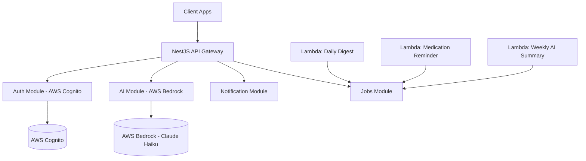

# Architecture Overview

Raaya is a health management platform backend designed with a cloud-native, AI-first approach. It leverages NestJS for its modular structure and AWS for its core infrastructure.

## 1. System Architecture

## 2. Core Modules

### 2.1 AI Integration
The AI module connects to **AWS Bedrock** to run the **Claude Haiku** model. It includes:
- **Guardrails**: Prevents the AI from giving medical advice.
- **Dialect Handling**: Adapts prompts to Egyptian, Saudi, or Levantine dialects.
- **Sentiment Analysis**: Adjusts the AI's tone based on the user's message.

### 2.2 Authentication & Security
- **Identity Provider**: AWS Cognito handles user identity.
- **JWT Validation**: The API uses `passport-jwt` and `jwks-rsa` to validate Cognito tokens.
- **RBAC**: Role-Based Access Control is implemented via custom decorators and guards.
- **Internal Jobs**: Protected via a shared secret (`JOB_SECRET`) between Lambda and the API.

### 2.3 Job Scheduling
The system uses an event-driven pattern for scheduled tasks:
1. **AWS EventBridge** triggers Lambda functions on a schedule.
2. **Lambdas** make secure POST requests to the `/jobs` endpoints of the main API.
3. The API executes the business logic (e.g., generating summaries, sending reminders).

## 3. Tech Stack
- **Framework**: NestJS (TypeScript)
- **AI**: AWS Bedrock (Claude 3 Haiku)
- **Deployment**: AWS EC2 (Dockerized), Lambda, ECR
- **CI/CD**: GitHub Actions
